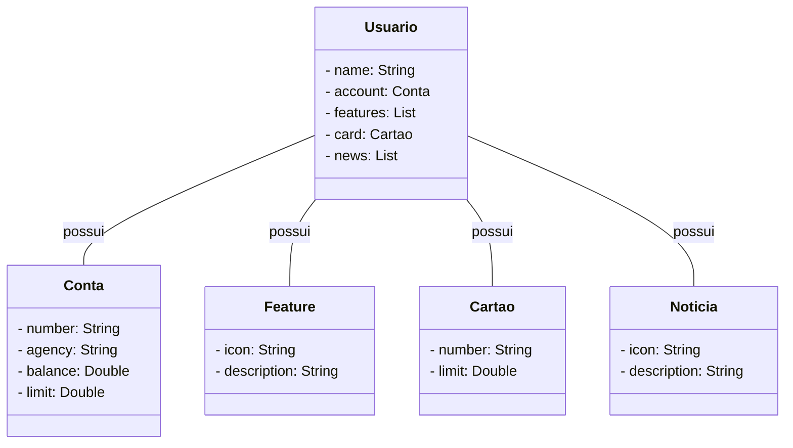

# Santander-dev-week-2023
Java RESTful API criada para a Santander Dev Week 

```mermaid
classDiagram
  class Usuario {
    - name: String
    - account: Conta
    - features: List<Feature>
    - card: Cartao
    - news: List<Noticia>
  }

  class Conta {
    - number: String
    - agency: String
    - balance: Double
    - limit: Double
  }

  class Feature {
    - icon: String
    - description: String
  }

  class Cartao {
    - number: String
    - limit: Double
  }

  class Noticia {
    - icon: String
    - description: String
  }

  Usuario -- Conta: possui
  Usuario -- Feature: possui
  Usuario -- Cartao: possui
  Usuario -- Noticia: possui


```
